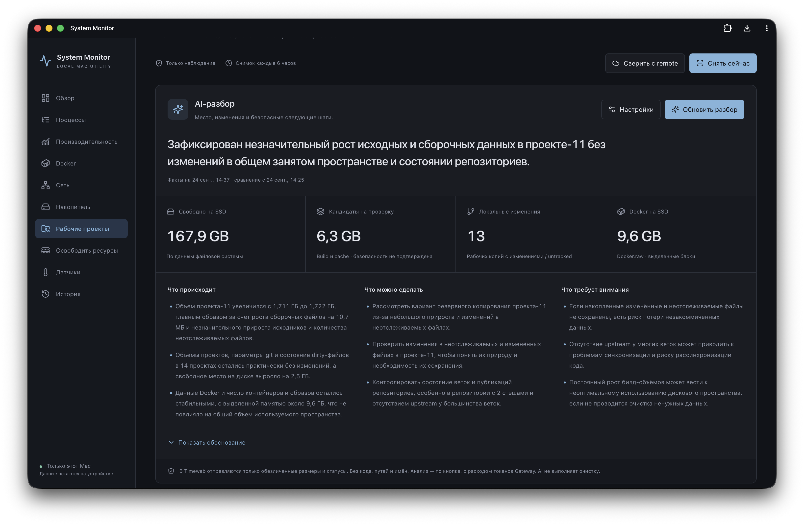
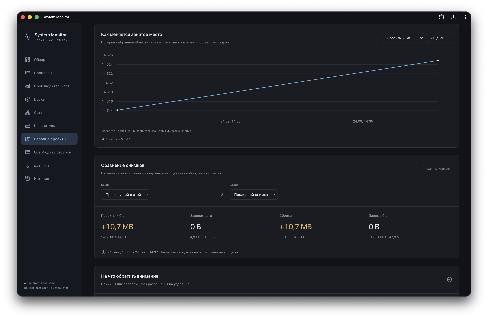
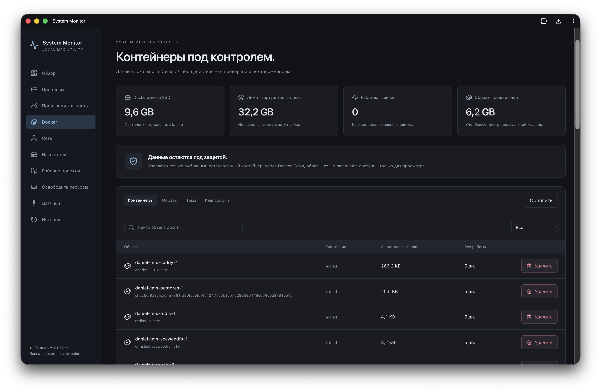
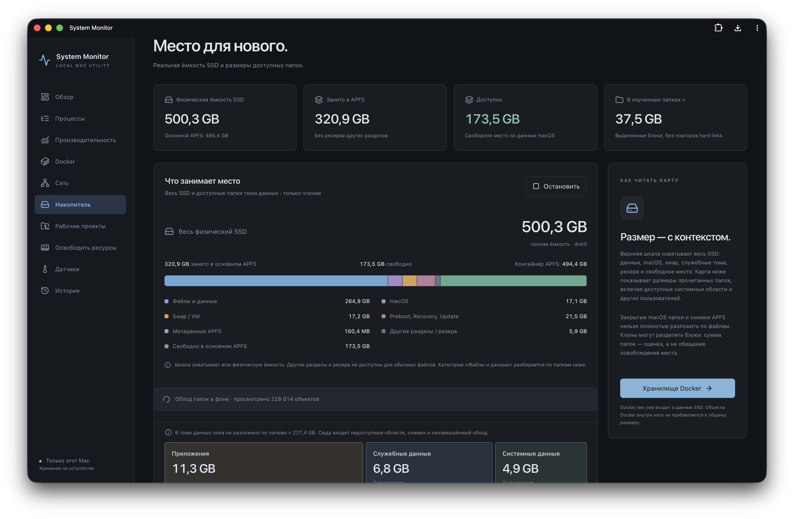
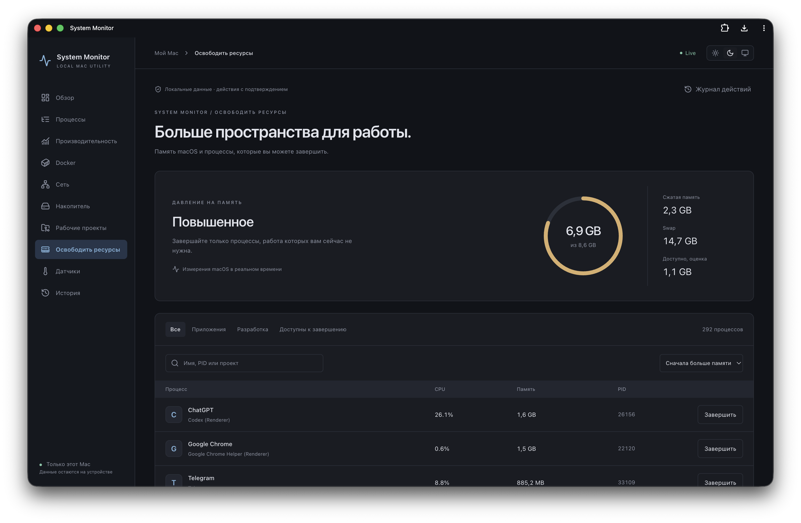
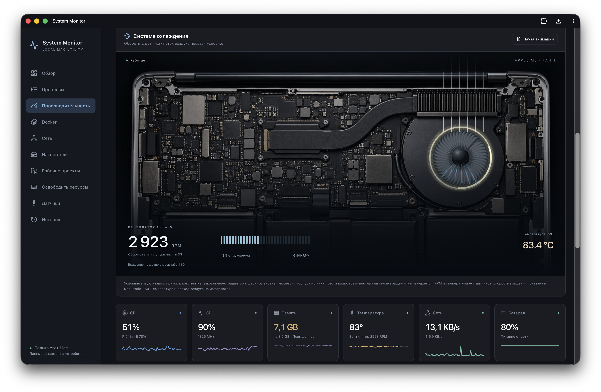
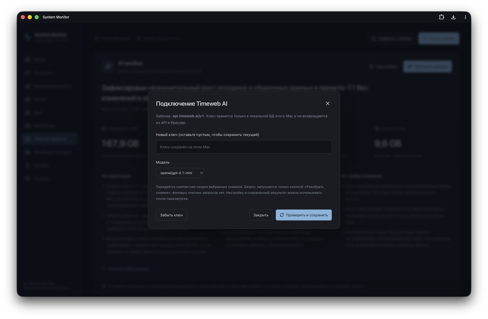

# Sysmo · System Monitor

**Рабочая панель разработчика на Mac.** Нагрузка системы, состояние Git-проектов, Docker и занятое место — с историей изменений и AI-подсказками для следующих шагов.

[](LICENSE)


Rust-агент собирает показатели, а PWA показывает их в браузере или отдельном окне. Основной мониторинг работает без аккаунта и облака. Опциональный AI-разбор отправляет обезличенные сводки в Timeweb Gateway только по кнопке; ключ и история хранятся локально. Встроенные разделы управления позволяют завершить выбранный процесс и остановить или удалить конкретный контейнер Docker после проверки и подтверждения.

> **Версия 0.2.0 · большое обновление для разработчиков.** Создана и проверена на MacBook Pro с Apple M3: 4P + 4E, 10 GPU-ядер, 8 GB RAM, macOS 26.5.1. Карта чипа пока привязана к этой конфигурации. Поддержка других Mac не подтверждена.

## Новое в 0.2.0

Sysmo помогает замечать, как рабочая среда обрастает зависимостями, сборками и контейнерами, и проверять состояние проектов перед любыми действиями.

| Задача | Что показывает Sysmo |
| --- | --- |
| Проверить «свежесть» репозиториев | Даты коммитов, ветки и worktrees, локальные изменения, untracked, stash, upstream и результат явной сверки с remote |
| Найти источник роста | История снимков за 90 дней, графики и сравнение размеров проектов, зависимостей, сборок, Git и Docker |
| Контролировать Docker | Контейнеры, образы, тома, кэш, время простоя; физический размер Docker.raw отдельно от лимита и объектов внутри |
| Понять, куда ушёл SSD | Полная физическая ёмкость, сегменты APFS, карта папок и фоновое сканирование с ручным запуском |
| Получить объяснение | AI-сводка через Timeweb: факты, возможные действия и риски Git; технические детали остаются открытыми |

Удаление Docker адресное: после подтверждения и повторной проверки можно удалить выбранный **остановленный контейнер**, без `force` и удаления томов. Его записываемый слой при этом удаляется — важные данные внутри контейнера нужно сохранить заранее. Образы, тома и кэш доступны для просмотра; папки Docker на Mac приложение не удаляет.

Старый коммит не означает ненужный проект, а совпадение с remote не защищает незакоммиченные файлы. Сборки и кэши обозначаются кандидатами **на проверку**, а не гарантированно безопасной очисткой. AI не выполняет команды и не удаляет данные.



[Описание обновления](CHANGELOG.md) · [Рабочие проекты и AI](docs/WORKSPACES.md)

## Возможности

- **Охлаждение:** вид внутренностей ноутбука с анимированным вентилятором, реальными RPM и шкалой скорости. Поток воздуха показан условно, это не измеренная карта течения. Вращение пропорционально датчику, замедлено в 60 раз; есть пауза и поддержка системного снижения движения.
- **Карта M3:** CPU, GPU, Neural Engine и unified memory. Переключение нагрузки и температуры, выбор блока и связанных графиков.
- **Живые графики:** CPU, GPU, RAM, compressed memory, swap, температура, мощность, сеть и диски. Высокие значения отмечаются жёлтым, пики — красным. Плавающие подсказки показывают дату, значения и пики; оси используют системный шрифт.
- **Процессы:** поиск, сортировка, группировка приложений, CPU, память и дисковый I/O; детали процесса, родительские связи и история.
- **Диагностика:** повышенное давление на память и длительная нагрузка с основными потребителями ресурсов.
- **Датчики:** температуры, частоты, вентиляторы, питание и батарея — когда macOS предоставляет данные.
- **Docker:** мониторинг и учёт контейнеров, образов, томов и кэша через локальный Unix socket. Отдельно показаны фактически занятое место Docker.raw и его лимит. Адресное удаление только остановленного контейнера, без force и без удаления томов. Образы, тома и кэш доступны только для просмотра.
- **Рабочие проекты:** размеры Git-репозиториев, worktrees, зависимостей, сборок и кэшей; история 90 дней и сравнение снимков. Локальные изменения, stash, ветки и явная сверка коммитов с remote. Учёт роста Docker. Короткая AI-сводка через Timeweb, карточки фактов и раскрываемое обоснование. Только наблюдение, без очистки. [Как пользоваться](docs/WORKSPACES.md).
- **Накопитель:** полная физическая ёмкость SSD и сегменты APFS: данные, macOS, swap, служебные тома, резерв и свободное место. Карта доступных папок тома данных (включая системные области и других пользователей) и крупнейшие файлы. Полное фоновое сканирование при запуске и раз в 6 часов, ручной запуск и остановка. Только метаданные; недоступные области отмечены.
- **Процессы и память:** реальные PID, нагрузка и память. SIGTERM выбранному процессу текущего пользователя после проверки PID и времени запуска. Система и Docker защищены. Без purge, массового завершения и обещаний фиксированного освобождения RAM.

- **История:** SQLite, системные показатели до 30 дней с постепенным уменьшением детализации.
- Светлая, тёмная и системная темы; адаптивная панель; установка как PWA.

## Быстрый запуск

### Требования

- Mac с Apple Silicon. Запускайте Terminal без Rosetta.
- Xcode Command Line Tools: `xcode-select --install`.
- [Node.js](https://nodejs.org/) 22.12+ или 24+ и Python 3.
- Интернет для первой сборки и загрузки зависимостей. Docker нужен только для раздела контейнеров.

Если пользуетесь Homebrew: `brew install node python`.

```sh
git clone https://github.com/soloveynchub/sysmo.git
cd sysmo
./start.command
```

**Что произойдёт:** проверка зависимостей → сборка frontend → тесты и сборка Rust → установка пользовательского LaunchAgent → открытие `http://127.0.0.1:9899`.

При отсутствии Rust скрипт скачает официальный rustup с `https://sh.rustup.rs` и установит toolchain в `.toolchain` внутри проекта. Профиль shell не меняется, `sudo` не используется. Если Rust уже установлен, используется существующий toolchain; он должен поддерживать зависимости из `Cargo.lock`.

Первый запуск занимает несколько минут. После сборки Node.js не работает в фоне: Rust-агент раздаёт готовый интерфейс. Раз в 6 часов отдельный Python-сборщик с пониженным приоритетом измеряет рабочие проекты; между обходами он не работает. **Не перемещайте и не удаляйте папку проекта после установки:** автозапуск ссылается на файлы в ней.

При скачивании ZIP можно открыть `start.command` двойным щелчком. Если у файла нет права запуска, выполните из Terminal в папке проекта `sh start.command`. Если macOS блокирует скачанный скрипт, используйте обычные средства разрешения запуска в настройках macOS; отключать Gatekeeper не требуется.

### Отдельное окно приложения

Откройте `http://127.0.0.1:9899` в Safari и выберите **Файл → Добавить в Dock** (Safari на macOS Sonoma или новее). Браузер с поддержкой установки PWA также подойдёт.

Закрытие окна не останавливает агент. Он работает от вашего пользователя и запускается при следующем входе в macOS. PWA без работающего агента не получает свежие данные.

## Управление

Все команды выполняются из папки проекта:

| Действие | Команда |
| --- | --- |
| Проверить состояние | `python3 scripts/manage.py status` |
| Открыть панель | `python3 scripts/manage.py open` |
| Остановить до следующего запуска/входа | `python3 scripts/manage.py stop` |
| Запустить снова | `python3 scripts/manage.py start` |
| Перезапустить | `python3 scripts/manage.py restart` |
| Установить или обновить автозапуск | `python3 scripts/manage.py install` |
| Остановить и удалить автозапуск | `python3 scripts/manage.py uninstall` |

Удаление автозапуска **сохраняет историю**. Для полного удаления после `uninstall` удалите папку проекта, PWA из Dock и, если история больше не нужна, `~/Library/Application Support/System Monitor`.

### Обновление

```sh
git pull --ff-only
./start.command
```

Пересоберётся приложение, агент перезапустится; история останется на месте. При первом обновлении индекса большой базы запуск может занять до двух минут. Перед обновлением сохраните собственные изменения исходников.

## Скриншоты

Реальные снимки Mac автора от 24 сентября 2026 года. Показатели и результаты AI отражают момент съёмки.

### Рабочие проекты: тренды и сравнение снимков



### Docker: размеры, простой и адресное управление



### Накопитель: весь физический SSD и сегменты APFS



### Освобождение ресурсов: память и выбранные процессы



### Охлаждение и системная нагрузка



### Подключение AI

Откройте **Рабочие проекты → AI-разбор → Настройки**, укажите свой ключ Timeweb Gateway и выберите модель. Ключ хранится только в локальной SQLite, не возвращается браузеру и не входит в Git. Это локальное хранение с правами доступа к файлу, а не Keychain или шифрование базы.

Запрос выполняется только по кнопке и расходует токены вашего Gateway. Передаются обезличенные размеры и статусы выбранных снимков — без кода, путей, имён проектов, названий веток и remote URL. Без ключа мониторинг и сравнение снимков работают самостоятельно.



## Как читать показатели

Объёмы в интерфейсе: B, KB, MB, GB, TB в десятичной системе (1 GB = 1000 MB). Скорости: B/s, KB/s, MB/s. Сохранённые измерения агента остаются в байтах.

- **CPU процесса:** 100% соответствует одному полностью занятому ядру; процесс может превышать 100%. Общая загрузка CPU и аппаратная активность ядер — разные измерения.
- **Память процесса:** physical footprint, при недоступности — RSS с маркировкой. Сумма процессов не равна уникальной занятой RAM из-за разделяемых страниц.
- **Memory pressure** сообщает macOS; это не просто процент занятой памяти. «Доступно» — приблизительная оценка free + inactive.
- **Температура:** общие показатели CPU/GPU. Отдельных температур ядер, DRAM, cache и fabric нет. Схема функциональная, а не физический план кристалла.
- **Neural Engine:** отображается мощность, не процент загрузки. `0 W` — счётчик не зарегистрировал энергию за интервал; `—` — счётчик недоступен. Это не доказательство отсутствия активности за всё время работы.
- **Цвета:** уровни внимания в интерфейсе, а не физические пределы или прогноз повреждения чипа. Диагностика учитывает длительность наблюдения.
- **Сеть:** интерфейсный трафик; VPN может приводить к повторному учёту. Сетевая атрибуция отдельных PID недоступна.

## Локальность и данные

Агент слушает только `127.0.0.1:9899`, проверяет Host/Origin. Операции управления дополнительно требуют токен текущего запуска и одноразовый план. У приложения нет собственного внешнего сервера. Зависимости скачиваются при сборке; значки в этом README загружаются GitHub с shields.io.

| Файл | Назначение |
| --- | --- |
| `~/Library/Application Support/System Monitor/history.sqlite` | Системная история и журнал действий |
| `~/Library/Application Support/System Monitor/development.sqlite` | Снимки рабочих проектов и сравнения |
| `~/Library/Application Support/System Monitor/workspace-ai.sqlite` | Ключ Timeweb, настройки и результаты AI |
| `~/Library/Application Support/System Monitor/agent.log` | Лог агента |
| `~/Library/Application Support/System Monitor/agent-error.log` | Ошибки |
| `~/Library/LaunchAgents/local.system-monitor.agent.plist` | Автозапуск |

Имена процессов, пути и аргументы команд могут содержать личные данные. Не прикладывайте сырую базу, ответы API и логи к публичным issues без проверки. Монитор не является изоляцией от других программ, работающих под вашим пользователем.

## Ограничения текущей версии

- Карта рассчитана на базовый M3 с указанной выше конфигурацией. Intel и другие модели Apple Silicon не проверены.
- Некоторые системные процессы защищены macOS: часть метрик будет недоступна. Root-права не запрашиваются.
- Целевой overhead менее 1% CPU пока **не достигнут**: в контрольном прогоне агент занимал в среднем около 6.8% одного ядра и до 54,5 MB physical footprint.
- Чтение реального Docker и отмена подготовленного удаления проверены. Удаление пользовательских контейнеров для проверки не выполнялось; HTTP-контракт проверен на изолированном stub.
- История процессов ограничена сутками и не имеет такой же многоуровневой агрегации, как системная история; на загруженной машине база может существенно расти.
- Автозапуск проверен через launchd; полноценная перезагрузка Mac в рамках проверки не выполнялась.
- Загрузка драйверов и датчиков зависит от версии macOS и внутренних интерфейсов Apple. Это ранняя версия, не диагностический инструмент Apple.

Подробности: [проверки](docs/VALIDATION.md), [архитектура](docs/ARCHITECTURE.md), [исходное ТЗ](docs/SPEC.md). ТЗ описывает целевой объём; не все критерии уже закрыты.

## Разработка

```sh
./scripts/setup.sh                  # сборка и Rust-тесты
./scripts/cargo.sh test --locked    # только тесты агента
python3 -m unittest discover -s scripts -p 'test_*.py' # сборщики, AI и SSD
cd frontend
npm ci
npm run build                      # TypeScript + production bundle
```

Структура: `agent/` — Rust, C/Objective-C bridge, SQLite и HTTP/WebSocket; `frontend/` — React, TypeScript, uPlot; `scripts/` — сборка и lifecycle. Для проверки интеграции используйте production bundle, который агент отдаёт на порту 9899: dev-сервер Vite не настроен как прокси API.

## Лицензия и зависимости

[MIT](LICENSE) — бесплатное использование, изменение и распространение, включая коммерческое, при сохранении уведомления об авторских правах и текста лицензии. Программа предоставляется без гарантий.

Спасибо [macmon](https://github.com/vladkens/macmon), [sysinfo](https://github.com/GuillaumeGomez/sysinfo), [uPlot](https://github.com/leeoniya/uPlot), React, Axum и SQLite. Зависимости распространяются по собственным лицензиям; лицензия Sysmo их не заменяет. Версии зафиксированы в `agent/Cargo.lock` и `frontend/package-lock.json`.

Подробнее об иллюстрации и границах точности: [Cooling asset](docs/COOLING_ASSET.md).
