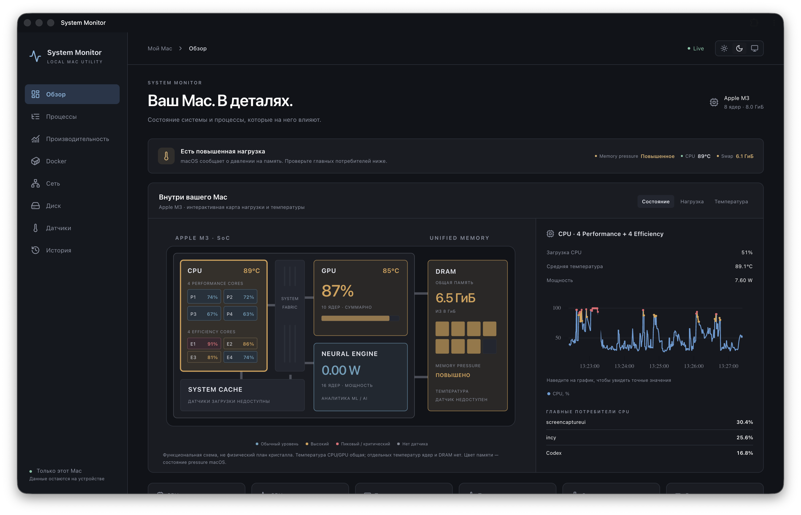
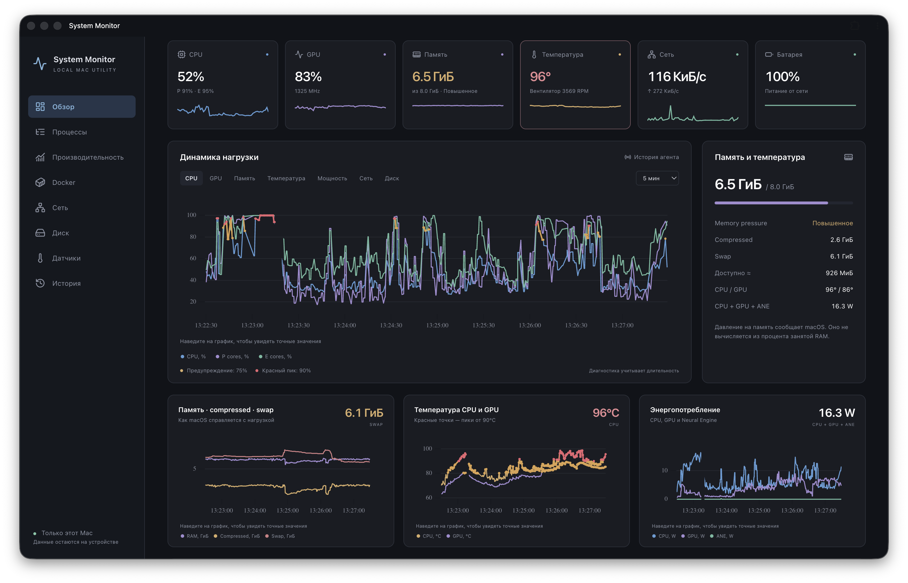
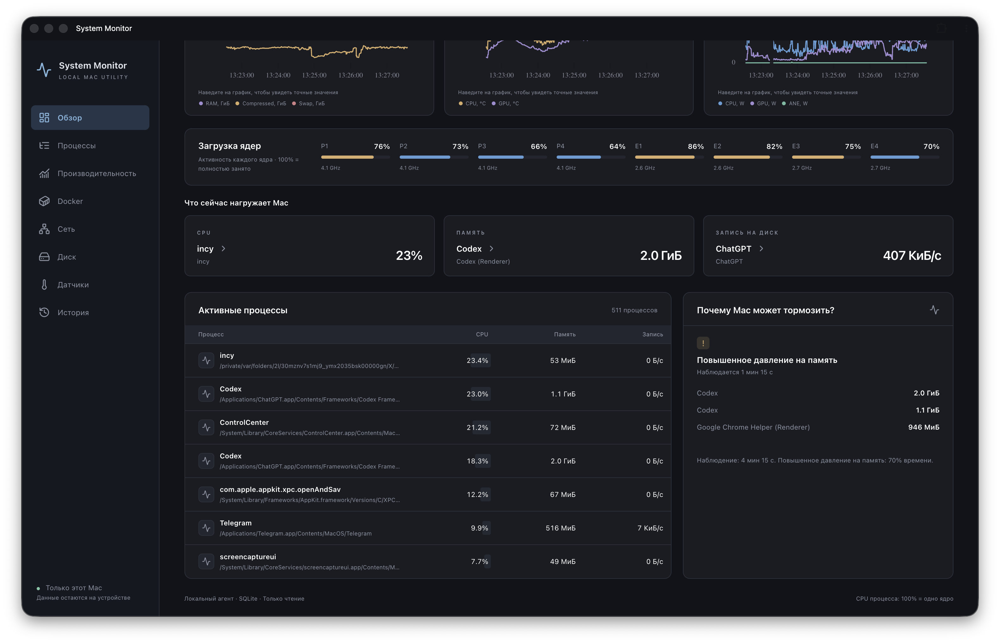
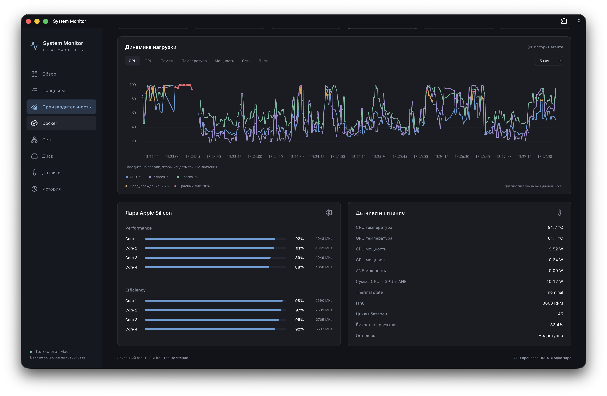

# Sysmo · System Monitor

**Ваш Mac. В деталях.** Локальный монитор ресурсов macOS с интерактивной картой чипа, историей нагрузки и объяснением возможных причин замедления.

[](LICENSE)


Rust-агент собирает показатели, а PWA показывает их в браузере или отдельном окне. Без аккаунта, облачного сервиса и телеметрии. Монитор наблюдает за системой: кнопок завершения процессов и остановки контейнеров нет.

> **Ранняя версия 0.1.0.** Создана и проверена на MacBook Pro с Apple M3: 4P + 4E, 10 GPU-ядер, 8 ГиБ памяти, macOS 26.5.1. Карта чипа пока привязана к этой конфигурации. Поддержка других Mac не подтверждена.



## Возможности

- **Карта M3:** CPU, GPU, Neural Engine и unified memory. Переключение нагрузки и температуры, выбор блока и связанных графиков.
- **Живые графики:** CPU, GPU, RAM, compressed memory, swap, температура, мощность, сеть и диски. Высокие значения отмечаются жёлтым, пики — красным.
- **Процессы:** поиск, сортировка, группировка приложений, CPU, память и дисковый I/O; детали процесса, родительские связи и история.
- **Диагностика:** повышенное давление на память и длительная нагрузка с основными потребителями ресурсов.
- **Датчики:** температуры, частоты, вентиляторы, питание и батарея — когда macOS предоставляет данные.
- **Docker:** мониторинг через локальный Unix socket, без удалённых Docker endpoints.
- **История:** SQLite, системные показатели до 30 дней с постепенным уменьшением детализации.
- Светлая, тёмная и системная темы; адаптивная панель; установка как PWA.

## Быстрый запуск

### Требования

- Mac с Apple Silicon. Запускайте Terminal без Rosetta.
- Xcode Command Line Tools: `xcode-select --install`.
- [Node.js](https://nodejs.org/) 22.12+ или 24+ и Python 3.
- Интернет для первой сборки и загрузки зависимостей. Docker нужен только для раздела контейнеров.

Если пользуетесь Homebrew: `brew install node python`.

```sh
git clone https://github.com/soloveynchub/sysmo.git
cd sysmo
./start.command
```

**Что произойдёт:** проверка зависимостей → сборка frontend → тесты и сборка Rust → установка пользовательского LaunchAgent → открытие `http://127.0.0.1:9899`.

При отсутствии Rust скрипт скачает официальный rustup с `https://sh.rustup.rs` и установит toolchain в `.toolchain` внутри проекта. Профиль shell не меняется, `sudo` не используется. Если Rust уже установлен, используется существующий toolchain; он должен поддерживать зависимости из `Cargo.lock`.

Первый запуск занимает несколько минут. После сборки Node.js не работает в фоне: один Rust-агент раздаёт готовый интерфейс. **Не перемещайте и не удаляйте папку проекта после установки:** автозапуск ссылается на файлы в ней.

При скачивании ZIP можно открыть `start.command` двойным щелчком. Если у файла нет права запуска, выполните из Terminal в папке проекта `sh start.command`. Если macOS блокирует скачанный скрипт, используйте обычные средства разрешения запуска в настройках macOS; отключать Gatekeeper не требуется.

### Отдельное окно приложения

Откройте `http://127.0.0.1:9899` в Safari и выберите **Файл → Добавить в Dock** (Safari на macOS Sonoma или новее). Браузер с поддержкой установки PWA также подойдёт.

Закрытие окна не останавливает агент. Он работает от вашего пользователя и запускается при следующем входе в macOS. PWA без работающего агента не получает свежие данные.

## Управление

Все команды выполняются из папки проекта:

| Действие | Команда |
| --- | --- |
| Проверить состояние | `python3 scripts/manage.py status` |
| Открыть панель | `python3 scripts/manage.py open` |
| Остановить до следующего запуска/входа | `python3 scripts/manage.py stop` |
| Запустить снова | `python3 scripts/manage.py start` |
| Перезапустить | `python3 scripts/manage.py restart` |
| Установить или обновить автозапуск | `python3 scripts/manage.py install` |
| Остановить и удалить автозапуск | `python3 scripts/manage.py uninstall` |

Удаление автозапуска **сохраняет историю**. Для полного удаления после `uninstall` удалите папку проекта, PWA из Dock и, если история больше не нужна, `~/Library/Application Support/System Monitor`.

### Обновление

```sh
git pull --ff-only
./start.command
```

Пересоберётся приложение, агент перезапустится; история останется на месте. Перед обновлением сохраните собственные изменения исходников.

## Скриншоты

Снимки реального M3, предоставленные автором; значения отражают момент съёмки.

### Графики и пики нагрузки



### Главные потребители ресурсов



### Производительность и датчики



## Как читать показатели

- **CPU процесса:** 100% соответствует одному полностью занятому ядру; процесс может превышать 100%. Общая загрузка CPU и аппаратная активность ядер — разные измерения.
- **Память процесса:** physical footprint, при недоступности — RSS с маркировкой. Сумма процессов не равна уникальной занятой RAM из-за разделяемых страниц.
- **Memory pressure** сообщает macOS; это не просто процент занятой памяти. «Доступно» — приблизительная оценка free + inactive.
- **Температура:** общие показатели CPU/GPU. Отдельных температур ядер, DRAM, cache и fabric нет. Схема функциональная, а не физический план кристалла.
- **Neural Engine:** отображается мощность, не процент загрузки. `0 W` — счётчик не зарегистрировал энергию за интервал; `—` — счётчик недоступен. Это не доказательство отсутствия активности за всё время работы.
- **Цвета:** уровни внимания в интерфейсе, а не физические пределы или прогноз повреждения чипа. Диагностика учитывает длительность наблюдения.
- **Сеть:** интерфейсный трафик; VPN может приводить к повторному учёту. Сетевая атрибуция отдельных PID недоступна.

## Локальность и данные

Агент слушает только `127.0.0.1:9899`, проверяет Host/Origin и предоставляет API только для чтения. У приложения нет собственного внешнего сервера. Зависимости скачиваются при сборке; значки в этом README загружаются GitHub с shields.io.

| Файл | Назначение |
| --- | --- |
| `~/Library/Application Support/System Monitor/history.sqlite` | Локальная история |
| `~/Library/Application Support/System Monitor/agent.log` | Лог агента |
| `~/Library/Application Support/System Monitor/agent-error.log` | Ошибки |
| `~/Library/LaunchAgents/local.system-monitor.agent.plist` | Автозапуск |

Имена процессов, пути и аргументы команд могут содержать личные данные. Не прикладывайте сырую базу, ответы API и логи к публичным issues без проверки. Монитор не является изоляцией от других программ, работающих под вашим пользователем.

## Ограничения текущей версии

- Карта рассчитана на базовый M3 с указанной выше конфигурацией. Intel и другие модели Apple Silicon не проверены.
- Некоторые системные процессы защищены macOS: часть метрик будет недоступна. Root-права не запрашиваются.
- Целевой overhead менее 1% CPU пока **не достигнут**: в контрольном прогоне агент занимал в среднем около 6.8% одного ядра и до 52 МиБ physical footprint.
- Docker-адаптер реализован, но работа с живыми контейнерами в контрольном окружении не проверена: daemon был остановлен.
- История процессов ограничена сутками и не имеет такой же многоуровневой агрегации, как системная история; на загруженной машине база может существенно расти.
- Автозапуск проверен через launchd; полноценная перезагрузка Mac в рамках проверки не выполнялась.
- Загрузка драйверов и датчиков зависит от версии macOS и внутренних интерфейсов Apple. Это ранняя версия, не диагностический инструмент Apple.

Подробности: [проверки](docs/VALIDATION.md), [архитектура](docs/ARCHITECTURE.md), [исходное ТЗ](docs/SPEC.md). ТЗ описывает целевой объём; не все критерии уже закрыты.

## Разработка

```sh
./scripts/setup.sh                  # сборка и Rust-тесты
./scripts/cargo.sh test --locked    # только тесты агента
cd frontend
npm ci
npm run build                      # TypeScript + production bundle
```

Структура: `agent/` — Rust, C/Objective-C bridge, SQLite и HTTP/WebSocket; `frontend/` — React, TypeScript, uPlot; `scripts/` — сборка и lifecycle. Для проверки интеграции используйте production bundle, который агент отдаёт на порту 9899: dev-сервер Vite не настроен как прокси API.

## Лицензия и зависимости

[MIT](LICENSE) — бесплатное использование, изменение и распространение, включая коммерческое, при сохранении уведомления об авторских правах и текста лицензии. Программа предоставляется без гарантий.

Спасибо [macmon](https://github.com/vladkens/macmon), [sysinfo](https://github.com/GuillaumeGomez/sysinfo), [uPlot](https://github.com/leeoniya/uPlot), React, Axum и SQLite. Зависимости распространяются по собственным лицензиям; лицензия Sysmo их не заменяет. Версии зафиксированы в `agent/Cargo.lock` и `frontend/package-lock.json`.
